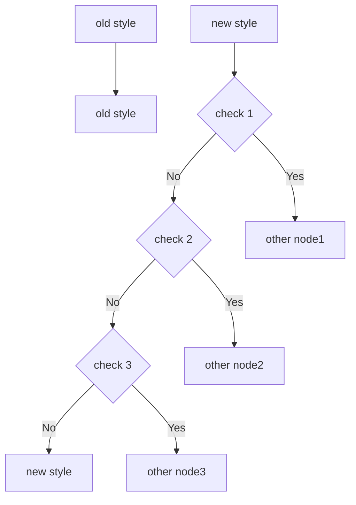

# vpp学习笔记

## 0 简介

当前机器已经有能力解决C10K问题，由于不同平台有不同的函数接口，推荐使用跨平台库，如libuv，libev等。

问题来到C10M，此时系统协议栈将成为阻碍，因此需要绕过。

> C10K: web servers to handle **ten thousand** clients simultaneously
>
> C10M: ... **ten million** ...

DPDK(Data plane development kit)是一个比较优秀的工具，但是直接操作网卡，协议栈需要一步一步往上搭，比较麻烦。故考虑使用vpp(vector packet processing)，这是FD.io(Fast Data Project)项目的子项目，底层使用DPDK，具有2-4层多平台、快速、可扩展的网络协议栈，运行于linux操作系统，支持容器化操作管理，并且已经应用于多种场景(cisco赞助并使用)。vpp更上层还有honeycomb管理接口，适用于SDN；ligato管理接口，适用于云端实现虚拟网络函数。

## 1 安装

教程节选自[官方文档](https://s3-docs.fd.io/vpp/22.02/index.html)

### 下载官方编译包

> 此方法一般用于vpp容器使用，依赖cli和配置文件修改运行功能。

在文件源 **/etc/apt/sources.list.d/99fd.io.list** 中添加

```textile
deb [trusted=yes] https://packagecloud.io/fdio/master/ubuntu bionic main
```

添加信任源

```shell
curl -L https://packagecloud.io/fdio/master/gpgkey | sudo apt-key add -
```

然后更新源并安装，最后一行为卸载包命令，其中vpp-api-python包看起来找不到，但不影响使用。

```shell
sudo apt-get update
sudo apt-get install vpp vpp-plugin-core vpp-plugin-dpdk
sudo apt-get install vpp-api-python python3-vpp-api vpp-dbg vpp-dev
sudo apt-get remove --purge "vpp*"
```

### 自行编译安装

> 此方法用于编写自己的vpp插件，编译过程自动集成自定义插件。

首先需要确保编译期间机器与 **github.com** 网站的连接稳定。

```shell
git clone https://gerrit.fd.io/r/vpp
cd vpp
```

确保没有安装vpp和dpdk，如果有先 **apt-get remove**

```shell
dpkg -l | grep vpp
dpkg -l | grep DPDK
```

在主目录下运行以下命令

```shell
make install-dep # 安装依赖包
make build # 编译debug版本
make build-release # 编译release版本
make pkg-deb # 构建debian安装包
sudo dpkg -i *.deb # 在build-root文件夹下安装编译后的包
```

运行一般不会一次成功，按照提示运行相关命令或者重新编译。

#### 安装踩坑

系统选择ubuntu20.04，当前vpp版本采用21.10.1，避免部分包在低版本找不到或没法编译

大部分安装不通过是网络问题，请确保连通github，然后指令重复run几遍一般就好了

小部分安装不通过是未达到编译要求内存8GB

```shell
# 关于部分软件包缺少信息源可以在/etc/apt/sources.list中添加
deb http://th.archive.ubuntu.com/ubuntu focal main universe
```

## 2 结构

vpp整体结构图


1. vpp infra: 基础库，包含基础的函数和数据结构，向量、hash、定时器
2. vlib：矢量包处理库，包含基础管理功能，节点、缓冲区、线程
3. vnet：网络协议栈库，包含平台、设备无关的协议栈，2、3、4层矢量包处理节点，流量管理，控制面接口，设备接口
4. plugins：插件库，包含丰富功能的集合。

## 3 使用

### 生产环境

#### 场景1

> 简单描述：ssh连接一台主机，开启一个或多个vpp实例，主机通过虚拟网口与vpp实例相连，主机发包测试。

```shell
# 关闭系统默认vpp服务
service vpp stop
# 启动自定义vpp实例
sudo /usr/bin/vpp -c startup1.conf
## startup1.conf 基础配置脚本
## unix {cli-listen /run/vpp/cli-vpp1.sock}
## api-segment { prefix vpp1 }
## plugins { plugin dpdk_plugin.so { disable } }
# 显示vpp进程
ps -eaf | grep vpp
# 创建连接主机的虚拟接口
sudo ip link add name vpp1out type veth peer name vpp1host
sudo ip link set dev vpp1out up
sudo ip link set dev vpp1host up
sudo ip addr add 10.10.1.1/24 dev vpp1host
# vpp实例中设置连接
sudo vppctl -s /run/vpp/cli-vpp1.sock
create host-interface name vpp1out
set int state host-vpp1out up
set int ip address host-vpp1out 10.10.1.2/24
show int addr
q
# 开启第二个vpp实例并建立memory share连接，第一个vpp实例作为路由中转
sudo /usr/bin/vpp -c startup2.conf
sudo vppctl -s /run/vpp/cli-vpp1.sock
create interface memif id 0 master
set int state memif0/0 up
set int ip address memif0/0 10.10.2.1/24
show int addr
q
sudo vppctl -s /run/vpp/cli-vpp2.sock
create interface memif id 0 slave
set int state memif0/0 up
set int ip address memif0/0 10.10.2.2/24
show int addr
q
# 配置ip路由表使第二个vpp与主机连通
sudo ip route add 10.10.2.0/24 via 10.10.1.2
ip route
sudo vppctl -s /run/vpp/cli-vpp2.sock
ip route add 10.10.1.0/24  via 10.10.2.1
q


# 删除已有vpp配置实例
ps -ef | grep vpp | awk '{print $2}'| xargs sudo kill
sudo ip link del dev vpp1host
# do the next command if you are cleaning up from this example
sudo ip link del dev vpp1vpp2
# 重新设置第一个vpp实例作为二层交换机中转
sudo ip link add name vpp1out type veth peer name vpp1host
sudo ip link add name vpp1vpp2 type veth peer name vpp2vpp1
sudo vppctl -s /run/vpp/cli-vpp1.sock
create host-interface name vpp1out
set int state host-vpp1out up
create host-interface name vpp1vpp2
set int state host-vpp1vpp2 up
q
sudo vppctl -s /run/vpp/cli-vpp2.sock
create host-interface name vpp2vpp1
set int state host-vpp1vpp2 up
q
# 设置二层网桥域
sudo vppctl -s /run/vpp/cli-vpp1.sock
show bridge-domain
set int l2 bridge host-vpp1out 1
set int l2 bridge host-vpp1vpp2 1
show bridge-domain 1 detail
q
# 设置回环接口
sudo vppctl -s /run/vpp/cli-vpp2.sock
create loopback interface
set int state loop0 up
set int ip address loop0 10.10.1.2/24
set int l2 bridge loop0 1 bvi
set int l2 bridge host-vpp2vpp1  1
s
```

#### 场景2

> 简单描述：ssh连接两台主机，各自开启一个vpp，在内网相互发包测试

#### 场景3

> 简单描述：单个vpp进程与主机通信

```shell
sudo /usr/bin/vpp -c startup1.conf
sudo ip link add name vpp1out type veth peer name vpp1host
sudo ip link set dev vpp1out up
sudo ip link set dev vpp1host up
sudo ip addr add 10.10.1.1/24 dev vpp1host
sudo vppctl -s /run/vpp/cli-vpp1.sock
create host-interface name vpp1out
set int state host-vpp1out up
set int ip address host-vpp1out 10.10.1.2/24
show int addr
trace add af-packet-input 10
```

> 基础效果：color get包通过color lookup节点检查，color-input节点上传到应用，color-output节点接收应用返回数据，填写校验和等参数，由ip4-lookup点配置输出。

```
Packet 2

00:00:11:199599: af-packet-input
  af_packet: hw_if_index 1 next-index 4
    tpacket2_hdr:
      status 0x20000001 len 106 snaplen 106 mac 66 net 80
      sec 0x622b2885 nsec 0x335fdbc0 vlan 0 vlan_tpid 0
00:00:11:199843: ethernet-input
  IP4: ba:5e:ca:48:31:ea -> 02:fe:a8:80:bf:70
00:00:11:199848: ip4-input
  unknown 150: 10.10.1.1 -> 10.10.1.2
    tos 0x00, ttl 64, length 92, checksum 0x63f5 dscp CS0 ecn NON_ECN
    fragment id 0x0001
00:00:11:199857: ip4-lookup
  fib 0 dpo-idx 7 flow hash: 0x00000000
  unknown 150: 10.10.1.1 -> 10.10.1.2
    tos 0x00, ttl 64, length 92, checksum 0x63f5 dscp CS0 ecn NON_ECN
    fragment id 0x0001
00:00:11:199864: ip4-local
    unknown 150: 10.10.1.1 -> 10.10.1.2
      tos 0x00, ttl 64, length 92, checksum 0x63f5 dscp CS0 ecn NON_ECN
      fragment id 0x0001
00:00:11:199868: CoLoR-lookup
  CoLoR protocol
origin string:72404800d94c000002080000ffffffffffffffffffffffffffffffff0101010101010101010101010101010101010101a5a5a5a5a5a5a5a5a5a5a5a5a5a5a5a567452301325476980000000000000000000000000000000000000000000000000
000000000000000000000000000000000000000000000000000000000000000
Version 7, Type GET
  ttl 64, packet_length 72, checksum 0x4cd9
00:00:11:199872: CoLoR-input
  CoLoR protocol
origin string:72404800d94c000002080000ffffffffffffffffffffffffffffffff0101010101010101010101010101010101010101a5a5a5a5a5a5a5a5a5a5a5a5a5a5a5a567452301325476980000000000000000000000000000000000000000000000000
000000000000000000000000000000000000000000000000000000000000000
Version 7, Type GET
  ttl 64, packet_length 72, checksum 0x4cd9

00:00:11:199876: CoLoR-output
  CoLoR protocol
origin string:72404800d94c000002080000ffffffffffffffffffffffffffffffff0101010101010101010101010101010101010101a5a5a5a5a5a5a5a5a5a5a5a5a5a5a5a567452301325476980000000000000000000000000000000000000000000000000
000000000000000000000000000000000000000000000000000000000000000
Version 7, Type GET
  ttl 64, packet_length 72, checksum 0x4cd9

00:00:11:199877: ip4-lookup
  fib 0 dpo-idx 2 flow hash: 0x00000000
  unknown 150: 10.10.1.2 -> 10.10.1.1
    tos 0x00, ttl 64, length 92, checksum 0x63f5 dscp CS0 ecn NON_ECN
    fragment id 0x0001
00:00:11:199879: ip4-rewrite
  tx_sw_if_index 1 dpo-idx 2 : ipv4 via 10.10.1.1 host-vpp1out: mtu:9000 next:3 flags:[] ba5eca4831ea02fea880bf700800 flow hash: 0x00000000
  00000000: ba5eca4831ea02fea880bf7008004500005c000100003f9664f50a0a01020a0a
  00000020: 010172404800d94c000002080000ffffffffffffffffffffffffffff
00:00:11:199882: host-vpp1out-output
  host-vpp1out 
  IP4: 02:fe:a8:80:bf:70 -> ba:5e:ca:48:31:ea
  unknown 150: 10.10.1.2 -> 10.10.1.1
    tos 0x00, ttl 63, length 92, checksum 0x64f5 dscp CS0 ecn NON_ECN
    fragment id 0x0001
```

#### 场景4

> 简单描述：vpp开启memif端口，应用程序调用libmemif库测试共享内存连接情况。

```shell
# 需要提前编译并安装libmemif库
mkdir -p extras/libmemif/build
cd extras/libmemif/build
cmake ..
make install
# 启动vpp进程
sudo /usr/bin/vpp -c startup1.conf
# 进入vpp配置memif接口
sudo vppctl -s /run/vpp/cli-vpp1.sock
create interface memif id 0 master
set int state memif0/0 up
set int ip address memif0/0 192.168.1.1/24
# 启动应答app (注意不同版本配置区别，另外文档说明可能与版本存在差异，以文件夹中文件为准)
sudo ./extras/libmemif/build/examples/icmp_responder-epoll
# 连接memif0/0
conn 0 0
# 在vpp中ping 192.168.1.2
ping 192.168.1.2
```

### 调试

```shell
# 不带gdb运行，可以使用cli测试
make run-release
make run
# 带gdb运行
make debug-release
make debug
```

### trace命令

> trace是vpp提供的包跟踪功能模块，可以监控通过vpp某些节点的包流向。

```shell
trace add af-packet-input 10
# 监控通过af-packet-input的10个数据包, memif接口使用memif-input
# ping from host to vpp
show trace
clear trace
# 显示arp表
show ip neighbors
# 显示路由表
show ip fib
```

### api使用

vpp api模块通过共享内存的方式提供交流接口。插件中定义的接口在编译阶段通过python的转换脚本转变为C或C++文件，外部程序可以通过这些文件与vpp交互。

c语言api缺少详细说明，暂时无视。（相关编译后代码位于vpp/build-root/build-vpp_debug-native/vpp/bin，可以对照源码学习）

c++语言api **TODO：文件研究中**

### cli使用

cli

### 容器使用

> PS：vpp实例本身使用就类似一个容器

container

### vpp代码格式

vpp支持代码自动格式化

```shell
make checkstyle
make fixstyle
```

## 4 修改

> 整理此部分内容正是本次学习笔记的起因。官方文档对于如何编写代码的描述简直惜字如金，多数步骤一笔带过，对于初学者来说难度极大。同时缺少对关键代码逻辑的描述，需要交叉对比多个教程自行理解。

### 修改包处理图路径

#### 4-1. 每个接口直接转

```c
 vnet_hw_interface_rx_redirect_to_node 
 (vnet_main, hw_if_index, my_graph_node.index /* redirect to my_graph_node */);
 vnet_hw_interface_rx_redirect_to_node 
 (vnet_main, hw_if_index, ~0 /* disable redirection */);
```

#### 4-2. 抓特定类型Ether包

```c
 ethernet_register_input_type (vm, ETHERNET_TYPE_CDP, cdp_input_node.index);
```

#### 4-3. 添加新IP协议包

> 本次color实现采用方法

```c
 ip4_register_protocol (IP_PROTOCOL_GRE, gre_input_node.index);
 ip6_register_protocol (IP_PROTOCOL_L2TP, l2t_decap_node.index);
```

#### 4-4. 抓特定端口的UDP包

```c
udp_register_dst_port (vm, UDP_DST_PORT_vxlan, 
                       vxlan_input_node.index, 1 /* is_ip4 */);
```

#### 4-5. 使用DPO类型配置转发表

vpp内置DPO类型专门用于转发表动作，具体操作参考[博客](https://www.asumu.xyz/blog/tags/vpp.html)

### 添加feature 与 feature arc

feature是一个抽象概念，区别于报文流图中具体的节点。

它提出来的目的是解决在报文流图中灵活处理连边，因为在此之前vpp将连边硬编码在节点内，如果想要修改处理流，需要重新编写代码。feature arc是目前使用的机制，它将多个feature串接在一起，一个feature一般对应一个node，通过node中不同的判断可以实现feature arc上的灵活转向，此外每个feature可以配置功能是否开启，进一步增强灵活性。



要添加一个feature arc非常容易，在arc起始node中用VNET_FEATURE_ARC_INIT注册arc，用vnet_feature_arc_start启动该feature arc。

feature arc中feature的顺序通过初始化时的偏序关系排出一个满足条件的执行序，无法满足会拒绝执行。

```c
//初始化feature arc代码
VNET_FEATURE_ARC_INIT (device_input, static) =
{
  .arc_name  = "device-input",
  .start_nodes = VNET_FEATURES ("device-input"),
  .arc_index_ptr = &feature_main.device_input_feature_arc_index,
};
// 再初始化这个arc下的feature，通过.runs_before来控制feature的先后关系，当然也有runs_after
VNET_FEATURE_INIT (worker_handoff, static) = {
  .arc_name = "device-input",
  .node_name = "worker-handoff",
  .runs_before = VNET_FEATURES ("ethernet-input"),
};

VNET_FEATURE_INIT (span_input, static) = {
  .arc_name = "device-input",
  .node_name = "span-input",
  .runs_before = VNET_FEATURES ("ethernet-input"),
};

VNET_FEATURE_INIT (ethernet_input, static) = {
  .arc_name = "device-input",
  .node_name = "ethernet-input",
  .runs_before = 0, /* not before any other features */
};
// 编译阶段把这些node都挂在对应的构造函数上，在初始化的时候就会调用
// 初始化vnet_feature_arc_init时会根据之前的配置，将各feature的先后关系排列好，此时只是排列好顺序，并未插入feature_arc中，也就是不会被调用到。
// 调用vnet_feature_enable_disable，此时才是将要用到的feature真正的插入feature_arc中
// 最后在初始节点调用vnet_feature_arc_start开始feature arc逻辑
```

简而言之，feature机制改变了节点的报文输出逻辑，更容易灵活配置，特别适合于开发一些扩展节点。

### 插入一个插件

从零开始编写全部插件内容比较困难，源码 **./extras/emacs** 中提供了构建插件的脚本，在插件文件夹 **./src/plugins** 下运行

```shell
cd ./src/plugins
../../extras/emacs/make-plugin.sh
```

脚本需要输入插件名和插件运行类型，完成后生成相应目录与文件。

#### vpp plugin文件结构与内容

##### CMakeLists.txt

```cmake
add_vpp_plugin (myplugin
SOURCES
    myplugin.c
    node.c
    myplugin_periodic.c
    myplugin.h

MULTIARCH_SOURCES
    node.c

API_FILES
	myplugin.api

API_TEST_SOURCES
	myplugin_test.c
)
```

- SOURCES: 一系列c语言源文件
- API_FILES: API定义文件，主要用于与vpp交互
- MULTIARCH_SOURCES: 主要影响性能的图节点文件
- API_TEST_SOURCES: API测试文件

按照需要修改CMakeList配置。

> 另外除了myplugin.h在项目编译阶段myplugin.api会被翻译成myplugin.api_types.h和myplugin.api_enum.h两个头文件供其他c代码使用，对于python语言，api文件会翻译一份json格式的文件供其解析使用。

##### myplugin.api

- 约定API消息接口。消息用于与VPP引擎沟通，可以是阻塞或非阻塞模式，可以配置修改数据处理路径或打开某些功能。

具体语言格式参见[VPP API 语言](#api-language)

##### node.c

- 实际逻辑处理节点

```c
VLIB_NODE_FN (myplugin_node) (vlib_main_t * vm, vlib_node_runtime_t * node,
                             vlib_frame_t * frame);
//结点功能实现

VLIB_REGISTER_NODE (myplugin_node);
//注册结点结构体
```

##### myplugin.c

- 插件的定义和初始化

```c
//注册插件名称及描述
VLIB_PLUGIN_REGISTER () =
{
  .version = VPP_BUILD_VER,
  /*.default_disabled = 1,*/
  .description = "myplugin plugin description goes here",
};
/* API definitions */
#include <myplugin/myplugin.api.c>
//插件初始化
static clib_error_t * myplugin_init (vlib_main_t * vm)
{
  myplugin_main_t * mmp = &myplugin_main;
  clib_error_t * error = 0;

  mmp->vlib_main = vm;
  mmp->vnet_main = vnet_get_main();

  /* Add our API messages to the global name_crc hash table */
  mmp->msg_id_base = setup_message_id_table ();

  return error;
}
//注册结点特征
VNET_FEATURE_INIT (myplugin, static) =
{
  .arc_name = "device-input",
  .node_name = "myplugin",
  .runs_before = VNET_FEATURES ("ethernet-input"),
};
//注册结点命令
VLIB_CLI_COMMAND (myplugin_enable_disable_command, static) =
{
  .path = "myplugin enable-disable",
  .short_help =
  "myplugin enable-disable <interface-name> [disable]",
  .function = myplugin_enable_disable_command_fn,
};
```

##### myplugin_periodic.c

- 常驻监听线程

```c
void myplugin_create_periodic_process (myplugin_main_t *mmp)
{
  /* Already created the process node? */
  if (mmp->periodic_node_index > 0)
    return;

  /* No, create it now and make a note of the node index */
  mmp->periodic_node_index = vlib_process_create (mmp->vlib_main,
    "myplugin-periodic-process",
    myplugin_periodic_process, 16 /* log2_n_stack_bytes */);
}
//创建监听线程响应事件
```

#### vpp plugin基本逻辑


### api接口定义

`<span id="api-language">`

```c
option version = "0.1.0";
import "vnet/interface_types.api";

autoreply define sample_macswap_enable_disable {
  /* Client identifier, set from api_main.my_client_index */
  u32 client_index;

  /* Arbitrary context, so client can match reply to request */
  u32 context;

  /* Enable / disable the feature */
  bool enable_disable;

  /* Interface handle */
  vl_api_interface_index_t sw_if_index;
};
```

采用了vpp自定义的一种类c风格语言，主要有三种类型的消息

- Request/Reply：调用端程序发送request消息，vpp引擎返回一条简单reply消息
- Dump/Detail：批量消息请求与返回，与前者的差别目测是一条和多条...
- event：异步消息响应，用于调用端程序监视vpp一些接口状态的改变

#### define

```c
define show_version
{
  u32 client_index;
  u32 context;
};
define show_version_reply
{
  u32 context;
  i32 retval;
  string program [32];
  string version [32];
  string build_date [32];
  /* The final field can be a variable length argument */
  string build_directory [];
};
```

```bison
define : DEFINE ID '{' block_statements_opt '}' ';'
define : flist DEFINE ID '{' block_statements_opt '}' ';'
flist : flag
      | flist flag
flag : MANUAL_PRINT
     | MANUAL_ENDIAN
     | DONT_TRACE
     | AUTOREPLY

block_statements_opt : block_statements
block_statements : block_statement
                 | block_statements block_statement
block_statement : declaration
                | option
declaration : type_specifier ID ';'
            | type_specifier ID '[' ID '=' assignee ']' ';'
declaration : type_specifier ID '[' NUM ']' ';'
            | type_specifier ID '[' ID ']' ';'
type_specifier : U8
               | U16
               | U32
               | U64
               | I8
               | I16
               | I32
               | I64
               | F64
               | BOOL
               | STRING
type_specifier : ID
```

#### option

```c
option version = "1.0.0";
```

```bison
option : OPTION ID '=' assignee ';'
assignee : NUM
         | TRUE
         | FALSE
         | STRING_LITERAL
```

#### typedef

```c
typedef u8 ip4_address[4];
typedef u8 ip6_address[16];
typedef address {
  vl_api_address_family_t af;
  vl_api_address_union_t un;
};
```

```bison
typedef : TYPEDEF ID '{' block_statements_opt '}' ';'
typedef : TYPEDEF declaration
```

#### import

```bison
import : IMPORT STRING_LITERAL ';'
```

#### comment

```bison
/* */
//
```

#### enum

```c
enum ip_neighbor_flags
{
  IP_API_NEIGHBOR_FLAG_NONE = 0,
  IP_API_NEIGHBOR_FLAG_STATIC = 0x1,
  IP_API_NEIGHBOR_FLAG_NO_FIB_ENTRY = 0x2,
};
```

```bison
enum : ENUM ID '{' enum_statements '}' ';'
enum : ENUM ID ':' enum_size '{' enum_statements '}' ';'
enum_size : U8
          | U16
          | U32
enum_statements : enum_statement
                | enum_statements enum_statement
enum_statement : ID '=' NUM ','
               | ID ','
```

#### services

```c
service {
  rpc want_interface_events returns want_interface_events_reply
    events sw_interface_event;
};
```

```bison
service : SERVICE '{' service_statements '}' ';'
service_statements : service_statement
                | service_statements service_statement
service_statement : RPC ID RETURNS NULL ';'
                     | RPC ID RETURNS ID ';'
                     | RPC ID RETURNS STREAM ID ';'
                     | RPC ID RETURNS ID EVENTS event_list ';'
event_list : events
           | event_list events
events : ID
       | ID ','
```

详细信息参见[文档](https://s3-docs.fd.io/vpp/22.02/interfacing/binapi/vpp_api_language.html)

### 节点间数据流

#### 数据结构

TODO：buffer frame

#### 传递方式

vpp自行定义了vector类型，包含内容类型和数量；中间节点传递传vector中的序号（并非指针）

### libmemif使用

1. 初始化
2. 收发包
3. 0拷贝

#### python c混合编程

暂定python 调用 ctype库
